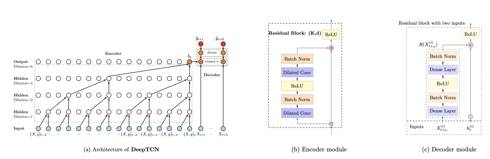
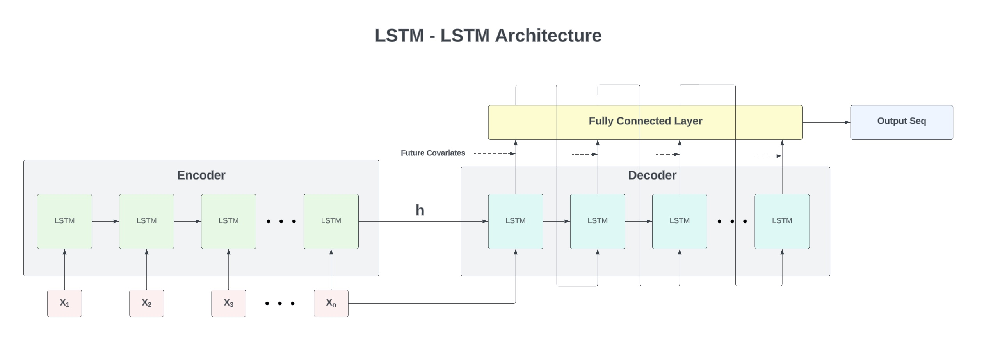
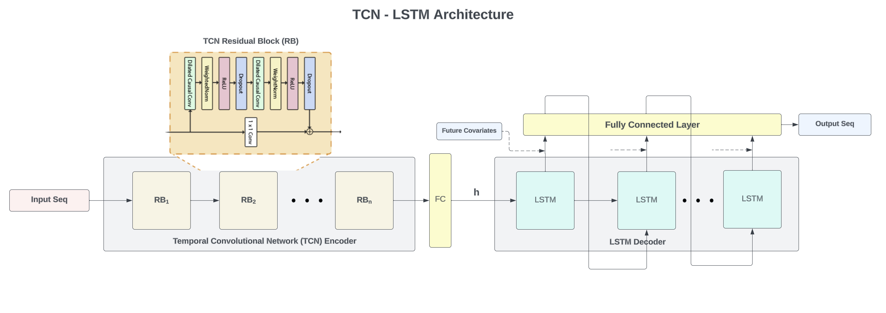
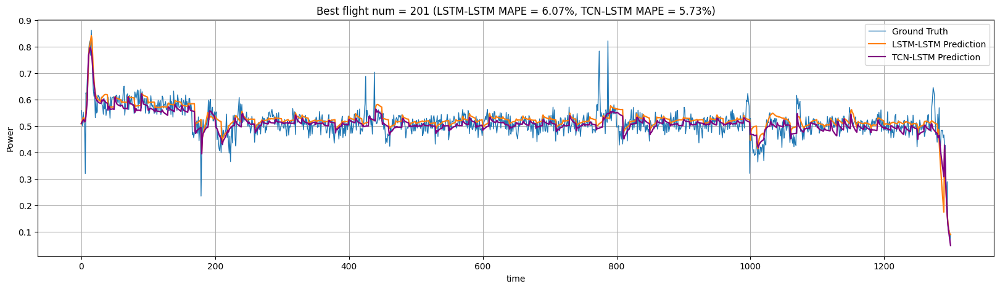
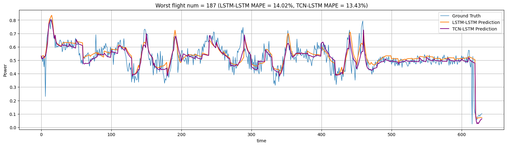
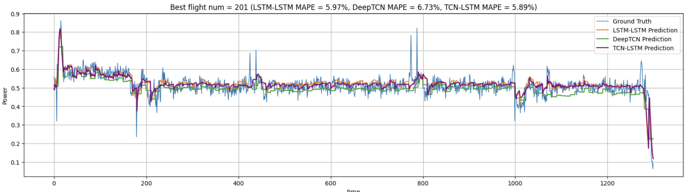
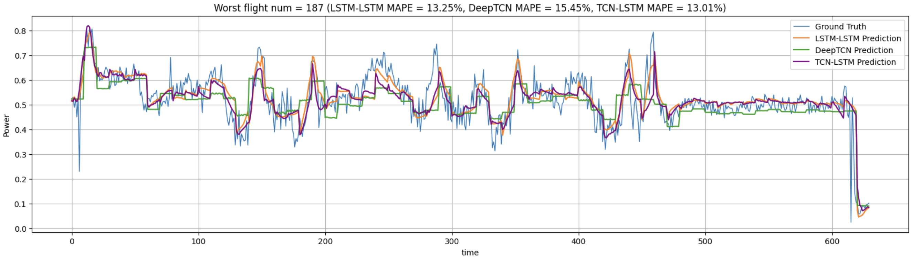

# Seq2Seq for Multivariate Time Series (553-EV-Project)

## Getting Started

These instructions will get you a copy of the project up and running on your local machine for development and testing purposes.

### Prerequisites

Before you begin, ensure you have the latest version of Python installed on your system. You can download Python from [python.org](https://www.python.org/downloads/).

### Installation

Follow these steps to set up your development environment:

1. **Create a Virtual Environment**

   ```sh
   python -m venv venv
2. **Activate the Virtual Environment**

    ```sh
    source venv/bin/activate
3. **Install the Dependencies**
    ```sh
    pip install -r requirements.txt

## Data

The data (_flights.csv_) can be found [here](https://kilthub.cmu.edu/articles/dataset/Data_Collected_with_Package_Delivery_Quadcopter_Drone/12683453/1?file=26385151). 
For more information about the data, one can refer to the [paperswithcode](https://paperswithcode.com/dataset/data-collected-with-package-delivery) and 
the [website](https://kilthub.cmu.edu/articles/dataset/Data_Collected_with_Package_Delivery_Quadcopter_Drone/12683453/1).

## Model

### deepTCN



### LSTM-LSTM


### TCN-LSTM


## Results

The following pictures show the best and worst results of the models on the testing flights, with and without covariates input. 
More details and discussions about the results as well as the models can be found in the [report](report/EECS553fa23-report.pdf). 

### without covariates



### with covariates


